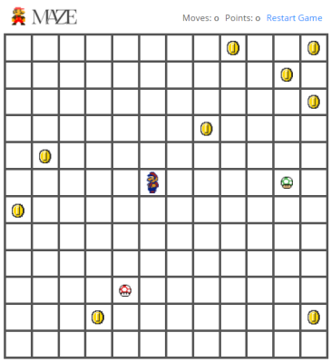
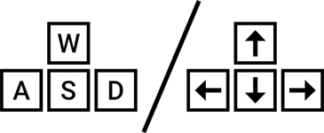

## Mario Maze

### Objective

Collect all the collectibles on the game board using the minimum number of steps

[Hosted/Playable Demo](https://think.dj/projects/convo/mario-maze/?from=github)



*Collectible points:*

 * Coin:  +1
 * Red Mushroom (Super):  +2
 * Green Mushroom (1Up):  +3

*Controls*



### XP Enhancements
 * Original Mario music and sound effects for them retro-feel
 * Mario responds to the direction of motion
 * Moves count and Points are always displayed on HUD

_______

### Optimizations
* Modern CSS3 Flexbox and Grid for unrestricted board blocks
* Prefetch of game sprites and assets
* Lazy-loaded modules
* Best practices for the app has been followed (eg: Interfaces for DOs, JSON for defining the game's `collectibles`)

### Caveats
For this project, the code has been written for more dynamicity & code readability than for performance

```
E.g:
[1]
this.gameSprites.findIndex(e => e.type === 'collectibles') 
Use of find/filter instead of using fixed indexes / constants
[2]
An Object is used as the primary data structure. 
A 2D array would perform much better for grid data
```
________

##### Development Info
This project was generated with [Angular CLI](https://github.com/angular/angular-cli) version **10.1**
###### Running the project
Clone the repo and run `npm i` to install dependencies
###### Development server
Then run `ng serve -o` for a dev server. 
The app will run at `http://localhost:4200/`. 
It will automatically reload if you change any of the source files.
###### Building
Run `ng build` to build the project. The build artifacts will be stored in the `dist/` directory. Use the `--prod` flag for the optimized production build config.
###### Testing
Run `ng test` to execute the unit tests via [Karma](https://karma-runner.github.io).

