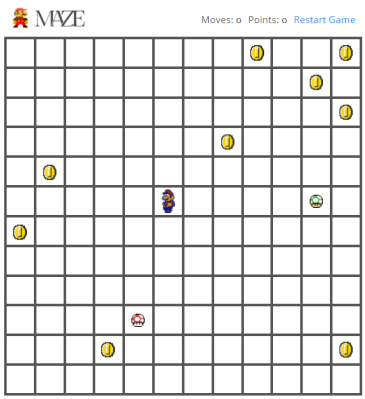
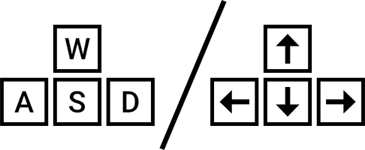

## Mario Maze

### Objective

Collect all the collectibles on the game board using the minimum number of steps

[Hosted/Playable Demo](https://think.dj/projects/convo/mario-maze/?from=github)



*Collectible points:*

 * Coin:  +1
 * Red Mushroom (Super):  +2
 * Green Mushroom (1Up):  +3

*Controls*



### XP Enhancements
 * Original Mario music and sound effects for them retro-feel
 * Mario responds to the direction of motion
 * Moves count and Points are always displayed on HUD

_______

### Optimizations
* Modern CSS3 Flexbox and Grid for unrestricted board blocks
* Prefetch of game sprites and assets
* Lightweight vanilla TypeScript implementation (no framework overhead)
* Fast Vite build system with HMR (Hot Module Replacement)
* Best practices for the app has been followed (eg: Interfaces for DOs, JSON for defining the game's `collectibles`)

### Caveats
For this project, the code has been written for more dynamicity & code readability than for performance

```
E.g:
[1]
this.gameSprites.findIndex(e => e.type === 'collectibles') 
Use of find/filter instead of using fixed indexes / constants
[2]
An Object is used as the primary data structure. 
A 2D array would perform much better for grid data
```
________

##### Development Info
This project is built with **Vanilla TypeScript** and **Vite** for a lightweight, fast development experience.

###### Running the project
Clone the repo and run `npm install` to install dependencies

###### Development server
Then run `npm start` or `npm run dev` for a dev server.
The app will run at `http://localhost:4200/`.
It will automatically reload with Hot Module Replacement (HMR) if you change any of the source files.

###### Building
Run `npm run build` to build the project. The build artifacts will be stored in the `dist/` directory, optimized for production.

###### Preview production build
Run `npm run preview` to preview the production build locally.

---

**Migration Note:** This project was originally built with Angular 10.1 and has been migrated to vanilla TypeScript for better performance, smaller bundle size, and easier maintenance.

